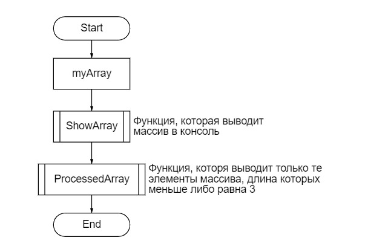

Итоговая проверочная работа.

Задание работы состоит в написании программы,
которая из имеющегося массива строк формирует массив 
из строк длина которых меньше либо равна 3.

В программе я задал массив типа string,
описал методы ShowArray и ProcessedArray,
первый выводит массив в его первоначальном виде,
второй метод выводит только те элементы массива,
длина которых меньше либо равна 3.

Блок-схема: 